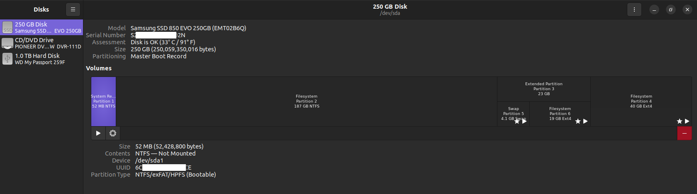

Hi everyone, I'm working on the lesson [Installations](https://www.theodinproject.com/lessons/foundations-installations).

Is the sequence in which a part for a "swap", a "home" and a part for the "root" is created essential?

In the article [how to install Ubuntu 22.04 and dual boot alongside Windows 10](https://medium.com/linuxforeveryone/how-to-install-ubuntu-20-04-and-dual-boot-alongside-windows-10-323a85271a73), according to the instructions, the sequence is as follows:

1) choose “Logical” for the partition type and select “swap area”.
2) for the “root” partition, select the “Primary”.
3) the last partition will be the “home” partition, a “Logical”.

A bit of context:
About a month ago, I, running ahead, tried to install Linux in parallel with Windows. The fact is that I was going to reinstall Windows anyway, so I decided that it would be a nice chance to test the result and see what kind of difficulties I would face before I got to this lesson in the curriculum.

Ubuntu/Windows Dual-Boot is my only option because virtualization is not supported on my machine, and VirtualBox and WSL2 do not work (I'm sure 99%, and as I'm not a strong in tech stuff, so I leave a chance for my mistake here).

I tried the last two options (VB & WSL2) in the past, and before this  dual-boot testing I tried Virtual Box again along with the Virtual Machine section. On step 2.2.4 I got an error, and after checking BIOS I ensured I don't have Virtualization supported.

My machine is:
- Processor: Pentium(R) Dual-Core CPU E5200 2.50GHz
- RAM: 8.00 GB
- SSD: Samsung 850 Evo 250 Gb
- External HDD: WD 1Tb
- Motherboard: Asus P5QL/EPU, Rev 1.01G
- Video: NVIDIA GeForce 8800 GT
- Windows 10 Pro N, version 22H2, OS build: 19045.4239
- Experience: Windows Feature Experience Pack 1000.19055.1000.0
- System type: 64-bit operating system, x64-based processor
- Partition scheme: MBR
- Windows Boot Loader: BIOS
- BIOS: version 0408, build date 07/20/09

At the creating the root partition stage for the Linux system (step 2), it was created but the rest of the free space became unavailable (not free space, I don't remember exactly the word that was mentioned, but it was grey and unavailable for selecting).

I tried a couple of times to go a step back and recreate the partitions (steps inside Ubuntu installation wizard) but every time I was getting the same result: swap - ok, root - ok, home - unavailable after the root partition created.

Therefore, I created a logical part for a "swap", THEN a logical part for "home", and left the rest of the space for the "root". That is, I completed steps 1-3-2, if compared with the sequence in the article.

As a result, the partition distribution was as shown in the screenshot.

Even though I had some errors during the Ubuntu installation process (I don't recollect exactly what those were but I think something with uefi -- I skipped them), the OS was installed successfully.

Everything worked, at least I didn't encounter any problems. At boot there was an option to select an OS, both systems (Windows & Ubuntu) started without problems, and both saw the external drive and the files saved on it by each OS.

Now, I have come to this lesson in the curriculum. I have Windows 10 installed and configured, and the unallocated space on the C drive is prepared.

I plan to install all three partitions on the SSD of the C drive in the same way as in the test version.

I expect the same sequence of creation partition as mentioned in the article on Medium. But my test showed a bit of another result, so I wonder if it is a big deal.

If I have such a situation again with the fact that after assigning the root partition, the remaining space becomes unavailable for the “home” partition to allocate, is it possible to change the sequence replacing steps 2 and 3?

Additional screenshots for reference if it helps:
